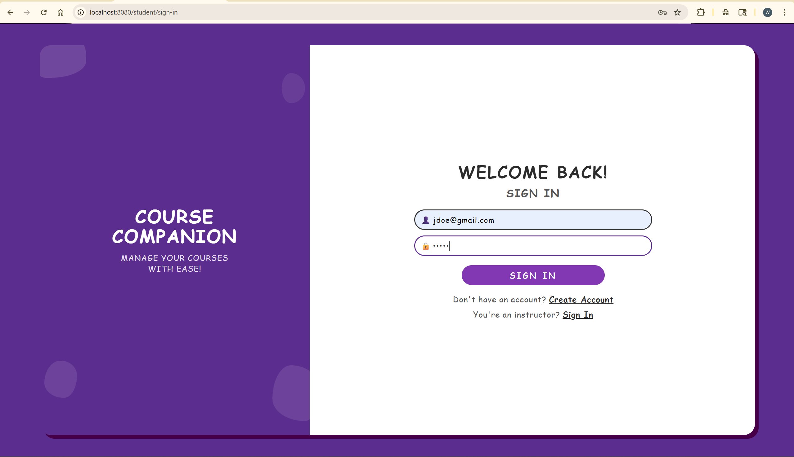
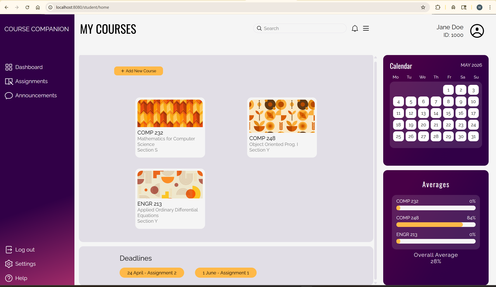
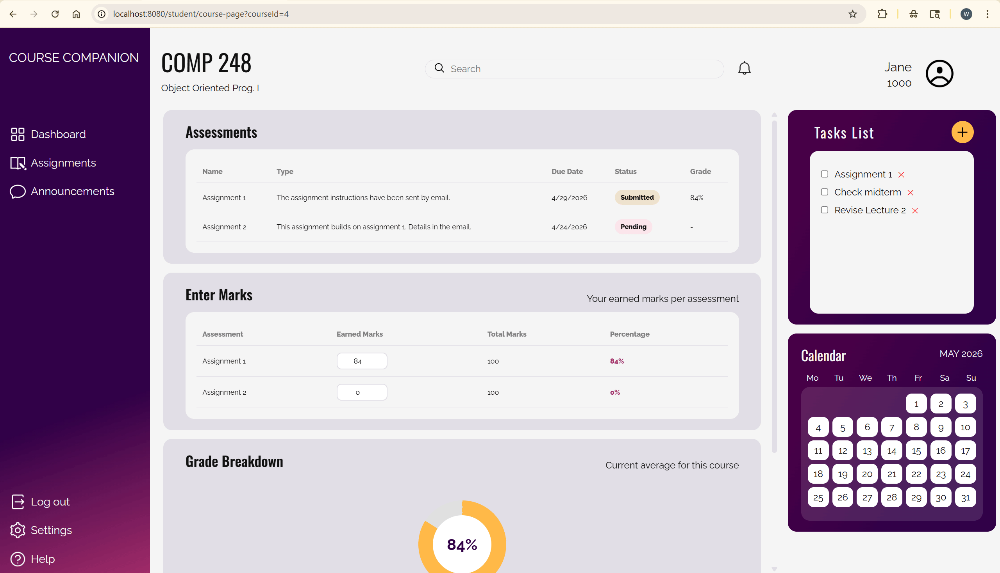
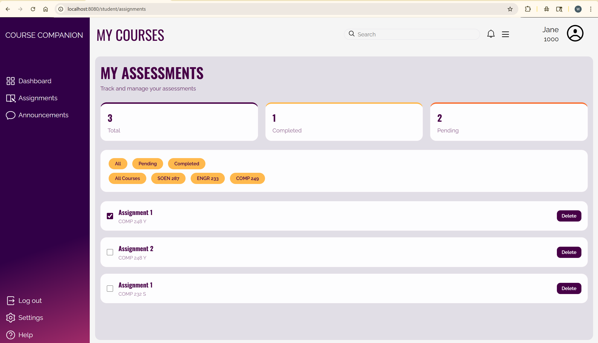
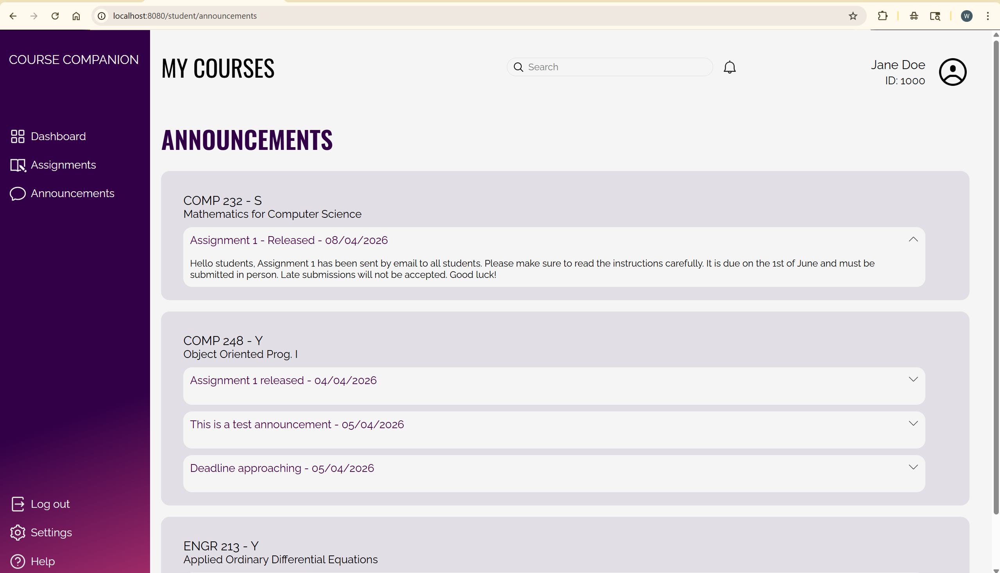
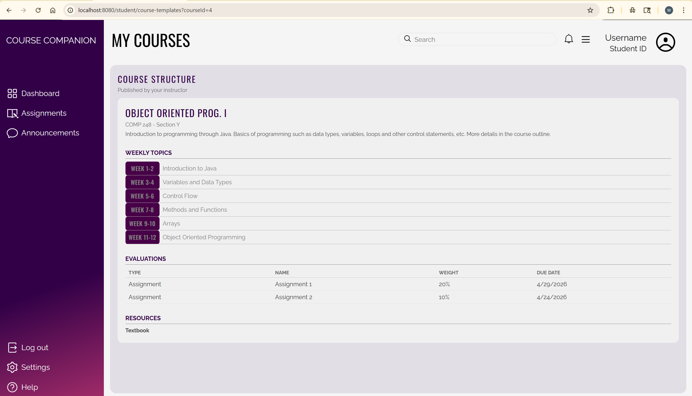
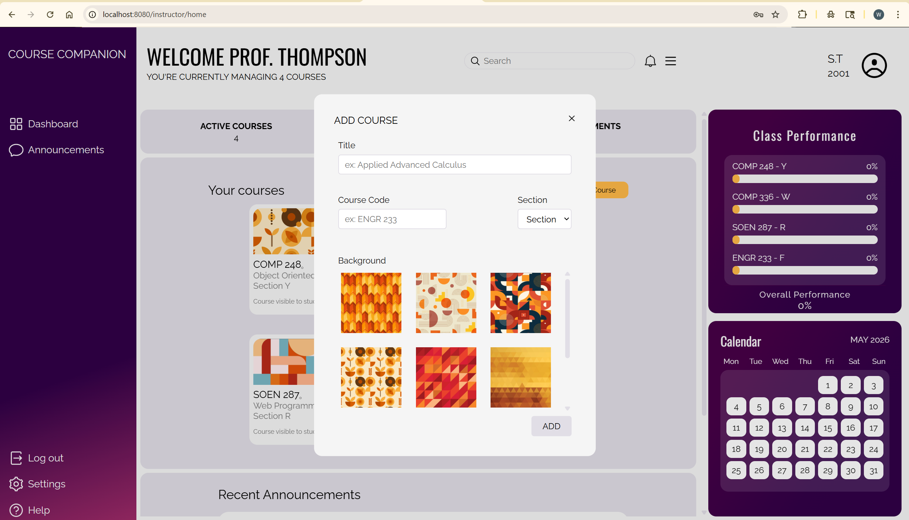
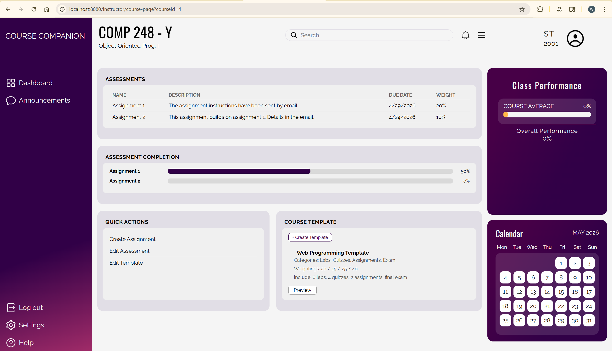
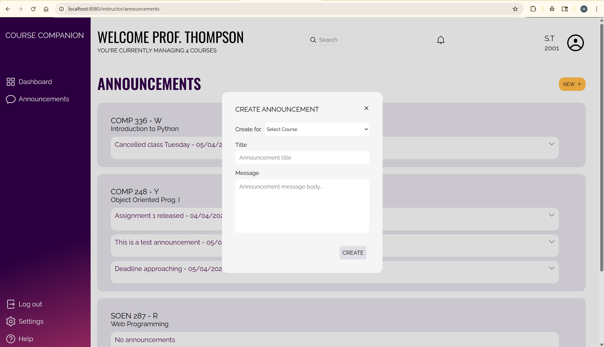
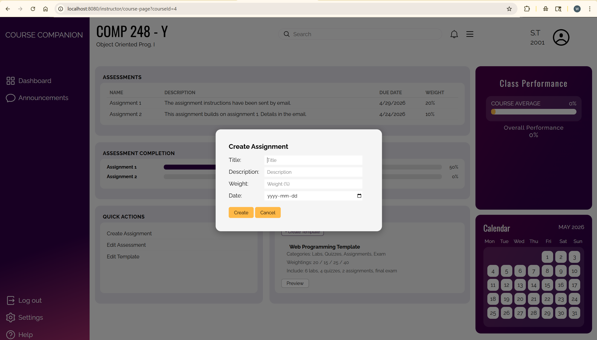

# Smart Course Companion
### <div align="center"> This is a web-based Smart Course Companion for students and instructors that stores and displays courses, assignments, grades, and announcements. </div>
### <div align="center"> HTML &bull; CSS &bull; Node.js &bull; MySQL </div>
### <div align="center"> RESTful API &bull; Express </div>

### Table of contents
* <a href="#features">Features</a>
* <a href="#technologies">Technologies</a>
* <a href="#screenshots---for-students">Running the project</a>
* <a href="#screenshots---for-students">Screenshots</a>
### Features
#### Student features:
- Courses
  * Add/delete a course
  * View all courses
  * View grades for all courses
- Assignments
  * View all assignments published by instructors
  * Filter assignments by completed/pending/by course
  * Enter grade for an assignment
  * Mark assignments as completed
  * View upcoming deadlines on the home page
- Announcements
  * View announcements by course published by instructor
- Course templates (aka Course outlines)
  * View course templates published by the instructor
- Tasks
  * A tasks list (to-do list) is displayed on the course home page
  * Add/edit/delete a task
  * Mark task as completed
#### Instructor features:
- Courses
  * Create/edit/delete a course
  * View all courses
  * Toggle visibility of course - show/hide from students
- Assignments
  * Create an assignment
  * View average student grades for an assignment
- Announcements
  * Create announcements
- Course templates (aka Course outlines)
  * Create/edit/delete course templates and publish to students

### Technologies:
- Backend: Node.js
- Frontend: HTML and CSS
- Data persistence: MySQL Database

### Running the project
#### This repository includes a docker-compose.yml file. If docker is already installed on the computer, run docker using the following command:
```
run docker
```
#### Then, run this command in the terminal at the directory location of the project folder:
```
docker compose up --build
```
#### Note that the docker-compose file takes certain variables from a .env file. The .env.example file contains those variables. Make sure to change the name of that file to .env before running the command. Certain variables in that file can be changed but it is not necessary.
You can create the file using the following command:
```
cp .env.example .env
```
#### Accessing the website:
The Smart Course Companion runs on port 8080. You will have to sign in. The sign in page can be accessed at the following URLs:

SIGN IN FOR STUDENTS: http://localhost:8080/student/sign-in \
Example account info for a student:\
username: jdoe@gmail.com | password: j1000

SIGN IN FOR INSTRUCTORS: http://localhost:8080/instructor/sign-in \
Example account info for an instructor:\
username: sthompson@gmail.com | password: s2001

ACCESSING THE DATABASE:\
Other account information is available in the MySQL database. This is also started up when the docker-compose.yml file is built. To view the database, phpmyadmin runs on port 8081 and can be accessed at the following link:\
http://localhost:8081/

To stop the project:
* Kill the program: CTRL + C
* Run the following command:
  ```
  docker compose down -v
  ```

### Screenshots - for students:
#### Student sign-in ↓ 
```
http://localhost:8080/student/sign-in
```


#### Student home page ↓ 
```
http://localhost:8080/student/home
```


#### Student course page ↓ 
```
http://localhost:8080/student/course-page?courseId=4
```


#### Student assignments ↓ 
```
http://localhost:8080/student/assignments
```


#### Student announcements ↓ 
```
http://localhost:8080/student/announcements
```


#### Student course templates ↓ 
```
http://localhost:8080/student/course-templates?courseId=4
```



### Screenshots - for instructors
#### The main pages are mostly similar to the student screenshots, with a difference of a few features. As such, only certain photos are shown for instructors.
#### Instructor home page ↓ 
```
http://localhost:8080/instructor/home
```
#### 
#### Instructor create course (modal) ↓ 
#### 
#### Instructor course page ↓ 
```
http://localhost:8080/instructor/course-page?courseId=4
```
#### 
#### Instructor create announcement (modal) ↓ 
#### 
#### Instructor create assignment (modal) ↓ 
#### 

